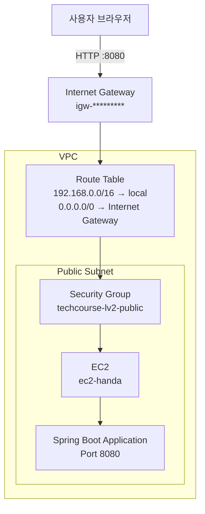

# wooteco-aws
AWS 배포 학습 저장소

## 산출물 
### 배포 서비스 

| 항목 | 내용 |
|---|---|
| 서비스 접속 주소 | [방탈출 예약 서비스 바로가기](http://ec2-3-36-106-35.ap-northeast-2.compute.amazonaws.com:8080/) |
| 배포 환경 | AWS EC2 |
| 애플리케이션 | Spring Boot |

### 보드게임 완주 여권

| 응답 패킷 관점 | 요청 패킷 관점 |
|---|---|
|||

### AWS 네트워크 구성도

